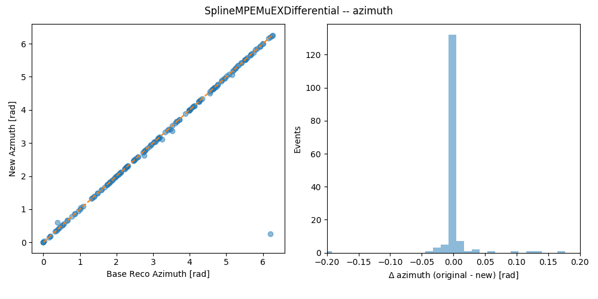

## About
In preparation for running new reconstructions, we did a comparison between the reconstruction done in 2015 and those we are doing with the tools in 2021.

The baseline files are here: `/data/wipac/HEE/simulation/level2/no-domsim/11900/Sunflower_240m/BaseProc/`

The baseline reconstructions are here: `/data/wipac/HEE/simulation/level2/no-domsim/11900/Sunflower_240m/BaseReco/`

The GCD file is: `/data/wipac/HEE/geometries/Sunflower/IceCubeHEX_Sunflower_240m_v3_ExtendedDepthRange.GCD.i3.bz2`

The [scripts used](https://code.icecube.wisc.edu/projects/icecube/browser/IceCube/sandbox/ayovych/gen2-simulation-studies/Gen2-Scripts/branches/isotropic-doms/trunk) are from Anastasiia.

We do the study for file `000000`.

## Rebooking Existing Information

The HDF5 files stored in baseline reco don't included some necessary variables like `SplineMPEMUEXDifferential`--so I wrote a script to rebook those. To do that, run:

`python do_rebook.py -i /path/to/11900_MUONGUN_.000000_Sunflower_240m_recos.i3.bz2 -p rebook_000000_`

The output of the rebooking for file `000000` is at `rebook_000000_.GEN2.hdf5`.

## Rerunning the Reco

To re-run the reco, we use `Gen2_Simple_Recos.py`. Use like:

`ulimit -s 131072; Gen2_Simple_Recos.py -g 240m_sunflower_gcd.i3.bz2 -p redo_00000_ -i /path/to/11900_MUONGUN_.000000_Sunflower_240m_calibrated.i3.bz2`

Note that we use the `ulimit` command to increase the size of the stack, otherwise `LineFit` in combo has a stack overflow issues that causes a crash.

## Results

We look at the `SplineMPEMuEXDifferential` result, and compare the `Base Reco` of 2015 to what was done with the new toools. We find that they're similar to within tolerances (see below).

The plot can be made by doing `python compare_old_and_new.py`

