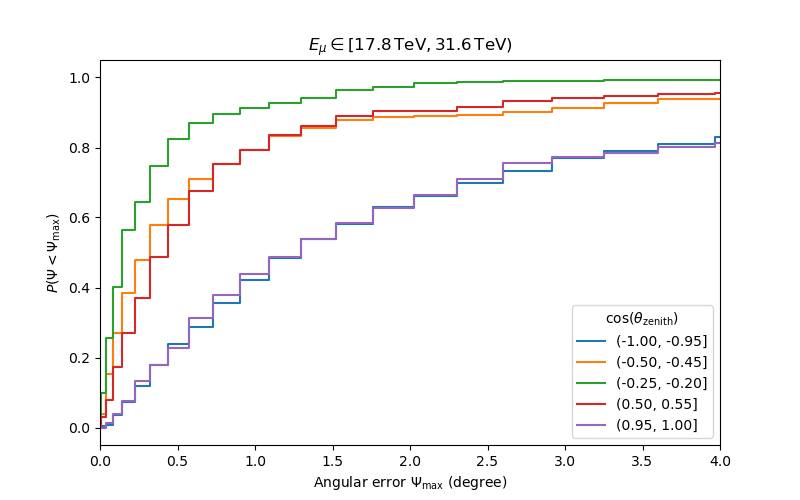
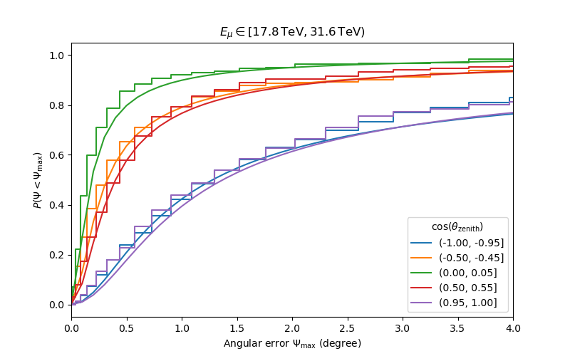
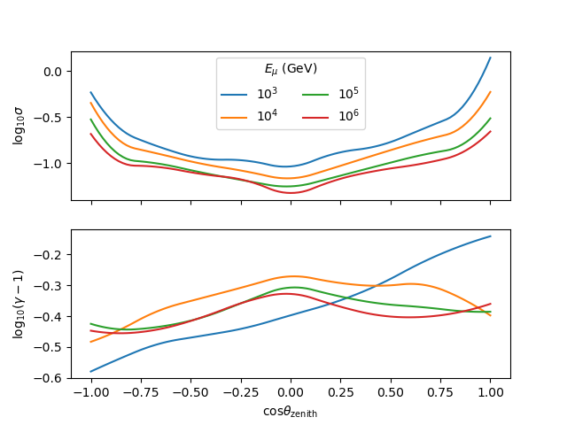
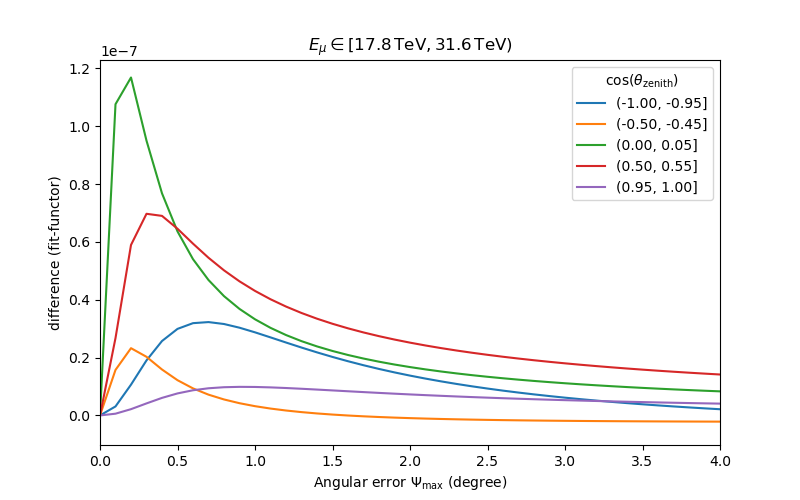

## About
We need a script to extract the PSF function from the hdf5 file. We need to have the Gen2 tool installed. We run like:

`python extract_PSF.py`

## Results

Tabulate angular error

Tabulated angular error with the King/Moffat fits

The fit parameters

Comparisons of the fits to what we get when we load the fits into the Gen2 framework and then get them back out again.
